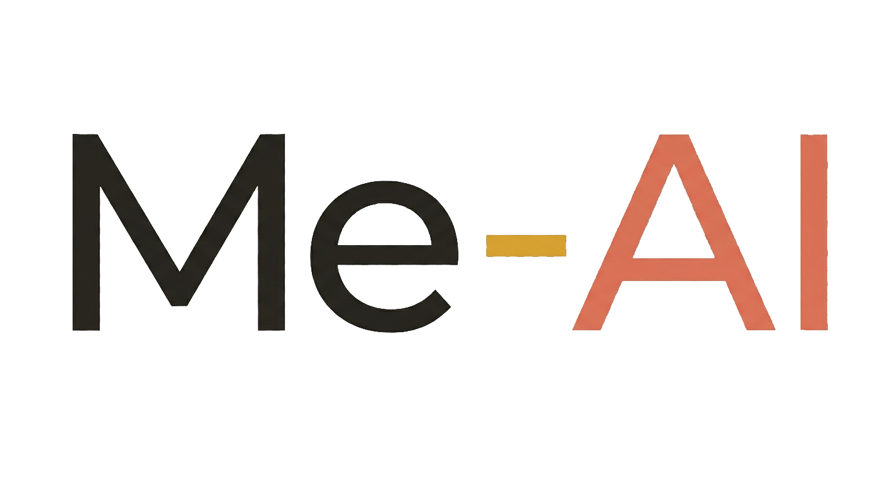
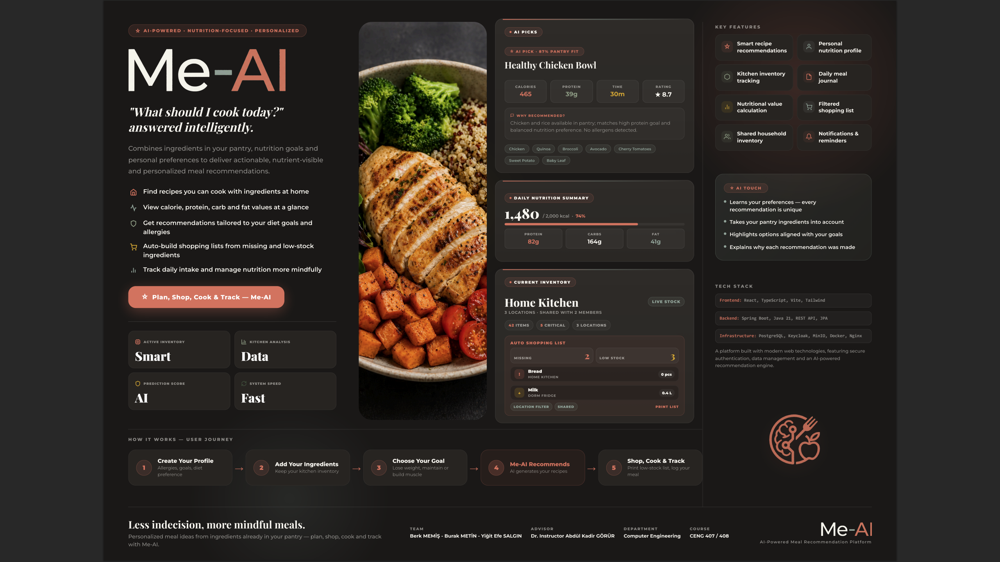

# AI-Powered Personalized Meal Recommendation Platform / AI Destekli Kişiselleştirilmiş Yemek Önerisi Platformu

<p align="center">
  
  <span style="display: inline-block; vertical-align: middle;">
    <picture>
      <source media="(prefers-color-scheme: dark)" srcset="frontend/src/assets/meal_logo_dark.png">
      <source media="(prefers-color-scheme: light)" srcset="frontend/src/assets/meal_logo_light.png">
      
    </picture>
  </span>
</p>

<p align="center">
  <strong>Advanced Software Architecture & Multi-Provider AI Integration Framework</strong><br>
  Developed as a Senior Graduation Project (CENG 407 & CENG 408)
</p>

<p align="center">
  
  
  
  
  
  
</p>

---

### 🖼️ Project Presentation Poster / Proje Tanıtım Posteri
<p align="center">
  
</p>

<p align="center">
  🎯 <strong>"What should I cook today?" answered intelligently.</strong><br>
  Combines ingredients in your pantry, nutrition goals and personal preferences to deliver actionable, nutrient-visible and personalized meal recommendations.
</p>

---

## 🗺️ Navigation / Dil Seçimi
[English Documentation](#english) | [Türkçe Dokümantasyon](#türkçe)

---

<a name="english"></a>
## 🇺🇸 / 🇬🇧 EN - English Documentation

### 🚀 Next-Gen Kitchen Experience
> 🌐 **"MealAI, which brings traditional kitchen habits together with the technology of the future, is not just a recipe application, but the next-generation operating system of your kitchen."**

#### 🎯 Our Mission & Vision
* **Our Mission:** To ensure everyone has a healthy and sustainable diet by blending traditional kitchen habits with modern technology.
* **Our Vision:** To become a global platform that prevents food waste and maximizes individual health by becoming the operating system of kitchens with our AI assistant.

#### 📊 System Execution Metrics & Architecture Foundations
| Metric | Domain | Architectural Purpose |
| :--- | :--- | :--- |
| **Smart** | **Active Inventory** | Real-time multi-location synchronization across shared household nodes. |
| **AI** | **Prediction Score** | Algorithmic pantry fitness calculation combined with downstream LLM optimization. |
| **Data** | **Kitchen Analysis** | Decentralized logging of historical consumption, macro bounds, and physical charts. |

#### 🌟 Intelligent Core FEATURES
* 🔄 **Smart Inventory Management:** Forget old-school notebooks and lists. Easily manage your inventory digitally and keep your shared kitchen in sync with family, roommates, or colleagues.
* 🧠 **Data-Driven, Personalized Kitchen for You:** An approach that goes beyond static lists and deeply analyzes every detail from your allergens to your diet goals.
* 📊 **Analysis-Oriented Approach:** An analysis structure that examines your past consumption, preferences, and physical traits; offering personalized guidance with charts and smart calculations.
* ⚡ **AI-Powered Recommendation:** An AI-powered system that analyzes every detail from allergens to diet goals, providing ideal recommendations considering your current inventory.
* 🌐 **Digitalized Kitchen Experience:** Your smartest kitchen partner that manages your kitchen with data, personalizes every meal, and digitalizes your nutritional habits with an analytical approach.

---

### 🔄 How It Works & Core Execution Pipeline

The platform is engineered around a **Decoupled Hybrid Execution** model. Core user profiling, dietary calculations, and relational database filtering operate entirely on our local backend without external dependencies. Advanced LLM refinement acts as a modular, plug-and-play scaling tier.

1. **Create Your Profile & Dynamic Provisioning:** Users establish core biological metrics (weight, height, age, gender, activity level). The backend service layer autonomously computes the **Body Mass Index (BMI)** and maps target calorie limits (**TDEE**) based on the chosen `DietaryGoal`.
2. **Add Your Ingredients & Live Sync:** Real-time digital tracking of shared inventories (`InventoryGroup`) across multi-member households. The system fetches the precise active pantry manifest to serve as the structural data foundation.
3. **Establish Constraints & Filters:**
   * **Hard Constraints (Allergies):** Relational SQL pre-filtering isolates allergen ingredients at the database level, ensuring 100% user safety before any AI involvement.
   * **Soft Constraints (Disliked Ingredients):** Ingredients the user prefers to avoid are passed to the local algorithmic engine to penalize recipe match scores rather than breaking queries.
4. **Me-Al Recommends (Dual-Engine Framework):**
   * **Standard Tier (Local & Free):** The system immediately processes the active inventory fit against **50,000+ nested recipe manifests**, executing mathematical macro-matching. **The app is fully functional out-of-the-box in this layer with zero cost.**
   * **AI-Enhanced Tier (BYOK - Bring Your Own Key):** Users can optionally choose their preferred AI provider (OpenAI, Gemini, Claude, DeepSeek) and securely save their personal API key via a client modal. The backend dynamic routing engine then injects the LLM into the tail-end of the pipeline to refine matches and generate natural-language context explanations (*"Why this meal fits your day"*).
5. **Shop, Cook & Track:** Automatically populates missing ingredients into localized shopping lists, logs consumed meals into the daily nutrition summary journal, and decrements live inventory stocks upon compilation.

---

### 🚀 Quick Start for Developers

#### 1. Clone the Repository
```bash
git clone [https://github.com/your-username/AI-Powered-Personalized-Meal-Recommendation-Platform.git](https://github.com/your-username/AI-Powered-Personalized-Meal-Recommendation-Platform.git)
cd AI-Powered-Personalized-Meal-Recommendation-Platform

```

#### 2. Full Stack Bootstrapping (All-in-One Docker)

Ensure Docker is active, then execute the following profile command to launch the entire ecosystem (Frontend, Backend, DB, Keycloak, MinIO) simultaneously:

```bash
docker compose --profile full up --build -d

```

#### 3. Access Matrix & Default Credentials

* **Frontend Client:** http://localhost:3030
* **Backend REST API:** http://localhost:8081
* **Keycloak Server:** http://localhost:8080 (Admin: `admin/admin`)
* **PostgreSQL Instance:** `localhost:5432`
* **Default App Account:** Username: `user` | Password: `password`

---

### 💻 Infrastructure-Isolated Local Development

If you prefer executing the frontend or backend in **hot-reload development mode** (via IDE / Vite) while maintaining structural storage and auth servers inside Docker:

```bash
# Step 1: Spin up only the auxiliary infrastructure
docker compose --profile infra up -d

# Step 2: Run Backend Application
# Execute 'MealRecommendationApplication' from your favorite Java IDE (IntelliJ/Eclipse)

# Step 3: Run Frontend Client
cd frontend
npm install
npm run dev
# The client runtime shifts to: http://localhost:3000

```

---

### 🌟 Core Architecture & Engineering Highlights

* **Thin Client Architecture:** Absolute centralization of business parameters, nutritional conversions, and computational state. The React client functions strictly as a presentation tier (Single Source of Truth paradigm).
* **Hybrid AI Recommendation Engine:** Executes a three-tiered evaluation pipeline:
1. Fast relational SQL pre-filtering against available datasets.
2. Dynamic algorithmic scoring based on nutritional thresholds.
3. LLM Refinement utilizing context-aware prompt payloads.


* **Negative Craving & Deep Matching:** Negative filters actively penalize scores rather than breaking queries. Cravings are mapped across the complete, nested structural ingredient manifests of **50,000+ recipes**, bypassing superficial title string matches.
* **Multi-Provider Multi-Model AI Client:** Built-in dynamic runtime switching and reliable fallback handling across OpenAI (GPT-4o), Google Gemini, Anthropic Claude, Mistral, and DeepSeek. Integrated with `Spring Retry` mechanisms to counteract external throttling.
* **Isolated Ephemeral Testing:** Implements `Testcontainers` within the integration testing suite to programmatically manage real PostgreSQL, MinIO, and Keycloak behaviors during continuous integration.

---

### 📂 Technical Project Structure

The project explicitly ditches generic monolithic styles for a highly decoupled, modular application footprint:

```markdown
├── backend/                             # Multi-Module Gradle Enterprise Architecture
│   ├── buildSrc/                        # Structural build plugins & centralized dependency tracking (libs.versions.toml)
│   └── modules/
│       ├── 01-infrastructure/           # Drivers, object clients (MinIO), and external LLM API abstractions
│       ├── 02-domain/                   # Isolated Pure Core Business Entities & Domain Contracts
│       ├── 03-application/              # Web Controller endpoints, global security filters, & application main runner
│       └── 04-utilities/                # Shared data-seeding engines & migration scripts
├── frontend/                            # Modular UI Framework via TypeScript & Vite
│   └── src/
│       ├── infrastructure/              # Contextual DI containers, Auth providers, and API Interceptors
│       ├── features/                    # Independent domain visual units (Dashboard, Inventory, Recipes)
│       └── shared/                      # Global UI building blocks & theme layouts
└── docs/                                # Technical Blueprints & AI Interaction schemas

```

---

### 🛠️ Production Technology Stack

#### Backend Tier

* **Runtime & Framework:** Java 21, Spring Boot 3.4.3, Gradle 8.14+ (Wrapper structure)
* **Data Layout:** PostgreSQL, MinIO (Object Storage framework for image distribution)
* **Security Architecture:** Keycloak OIDC (Standalone custom client themes embedded)
* **Quality Metrics:** JaCoCo & SonarQube automation for target assertion tracking

#### Frontend Tier

* **Core UI Engine:** React 18, TypeScript, Vite Bundler
* **Styles & Interactivity:** Tailwind CSS, Axios Client, Keycloak JS Adaptor, Full client-side Internationalization (i18n)

---

### 👥 Project Framework & Demographics

* **Development Team:** Berk MEMİŞ, Burak METİN, Yiğit Efe SALGIN
* **Academic Advisor:** Dr. Instructor Abdül Kadir GÖRÜR
* **Department & Course:** Computer Engineering Department — CENG 407/408

---
<a name="türkçe"></a>
## 🇹🇷 TR - Türkçe Dokümantasyon

### 🚀 Yeni Nesil Mutfak Deneyimi

> 🌐 **"Geleneksel alışkanlıkları geleceğin teknolojisiyle buluşturan MealAI, sadece bir tarif uygulaması değil, mutfağınızın yeni nesil işletim sistemidir."**

#### 🎯 Misyonumuz ve Vizyonumuz

* **Misyonumuz:** Geleneksel mutfak alışkanlıklarını modern teknolojiyle harmanlayarak, herkesin sağlıklı ve sürdürülebilir bir beslenme düzenine sahip olmasını sağlamak.
* **Vizyonumuz:** Yapay zeka asistanımızla mutfakların işletim sistemi haline gelerek, gıda israfını önleyen ve bireysel sağlığı maksimize eden küresel bir platform olmak.

#### 📊 Sistem Çalışma Metrikleri ve Mimari Temeller

| Metrik | Çalışma Alanı | Mühendislik Amacı |
| --- | --- | --- |
| **Smart** | **Aktif Envanter** | Paylaşımlı ev, yurt veya iş yerlerindeki mutfak stoklarının anlık dijital senkronizasyonu. |
| **AI** | **Tahmin Skoru** | Envanter uyumluluğu, matematiksel makro puanlaması ve LLM süzgecinin ortak hibrit çıktısı. |
| **Data** | **Mutfak Analizi** | Geçmiş tüketimlerin, fiziksel metrik değişimlerinin grafikler ve akıllı hesaplamalarla takibi. |

#### 🌟 Intelligent Core Öne Çıkan Özellikler

* 🔄 **Akıllı Envanter Yönetimi:** Eski usul defterleri ve listeleri unutun. Mutfak asistanınızla envanterinizi dijitalde kolayca yönetin; aileniz, ev veya iş arkadaşlarınızla ortak mutfağınızı senkronize tutun.
* 🧠 **Veriyle Yönetilen, Sizin İçin Kişiselleşen Mutfak:** Statik listelerin ötesine geçerek; alerjenlerinizden diyet hedeflerinize kadar her detayı derinlemesine analiz eden bir yaklaşım.
* 📊 **Analiz Odaklı Yaklaşım:** Geçmiş tüketimlerinizi, tercihlerinizi ve fiziksel özelliklerinizi analiz eden; grafikler ve akıllı hesaplamalarla size özel yönlendirmeler sunan analiz yapısı.
* ⚡ **Yapay Zeka Destekli Öneri:** Alerjenlerinizden diyet hedeflerinize kadar her detayı analiz ederek envanterinizdeki malzemeleri göz önüne alan ve size en ideal önerileri hazırlayan AI destekli yapı.
* 🌐 **Dijitalleşen Mutfak Deneyimi:** Mutfağınızı veriyle yöneten, her öğünü sizin için kişiselleştiren ve analiz odaklı yaklaşımıyla beslenme alışkanlıklarınızı dijitalleştiren en akıllı mutfak ortağınız.

---

### 🔄 Nasıl Çalışır ve Sistem İşleyişi

Platform, **Ayrık Hibrit Çalışma (Decoupled Hybrid Execution)** modeli üzerine kurulmuştur. Kullanıcı profilleme, besin hesaplamaları ve ilişkisel veritabanı filtrelemeleri hiçbir dış bağımlılık olmaksızın tamamen yerel backend üzerinde koşar. İleri düzey yapay zeka (LLM) katmanı ise sisteme modüler olarak takılıp çıkarılabilen (plug-and-play) bir süzgeç katmanıdır.

1. **Profil Yapılandırması ve Otonom Hesaplama:** Kullanıcılar temel fiziksel metriklerini (boy, kilo, yaş, cinsiyet, aktivite seviyesi) girer. Backend servis katmanı, bu verilerden hareketle **Vücut Kitle İndeksini (BMI)** otonom hesaplar ve seçilen `DietaryGoal` (kilo verme, kas yapma vb.) doğrultusunda günlük hedef kaloriyi dinamik olarak belirler.
2. **Canlı Envanter Senkronizasyonu:** Paylaşımlı envanter gruplarındaki (`InventoryGroup`) mutfak stokları anlık taranır. Aile, ev veya iş arkadaşları arasındaki ortak mutfaklar gerçek zamanlı olarak senkronize edilir.
3. **Kısıtlamaların ve Filtrelerin İşlenmesi:**
* **Sert Kısıtlamalar (Alerjiler):** Kullanıcının alerji listesi, ilişkisel veritabanı (SQL) seviyesinde kesin filtre olarak çalışır; alerjen içeren tarifler yapay zekaya dahi gitmeden **ilk aşamada %100 güvenlik amacıyla elenir**.
* **Esnek Kısıtlamalar (Sevmediği Malzemeler):** Kullanıcının tercih etmediği malzemeler sorguyu bozmaz; yerel algoritma tarafından ilgili tariflerin **tahmin skorunu (Prediction Score) düşürmek** üzere soft-constraint olarak işlenir.


4. **Me-Al Önerir (Çift Motorlu Süreç):**
* **Standart Seviye (Yerel ve Ücretsiz):** Sistemimiz, aktif envanter durumunu **50.000'den fazla tarifin** derin malzeme ağaçlarıyla eşleştirir ve makro hedeflere göre matematiksel puanlama yapar. **Uygulama bu haliyle tamamen ücretsiz ve dışa bağımsız çalışabilir.**
* **Yapay Zeka Destekli Seviye (BYOK - Kendi Anahtarını Getir):** Kullanıcılar istedikleri takdirde arayüzden tercih ettikleri yapay zeka sağlayıcısını (OpenAI, Gemini, Claude, DeepSeek) seçip açılan modal üzerinden kendi API anahtarını sisteme güvenlice tanımlayabilir. Backend dinamik yönlendirme motoru, bu anahtarı kullanarak yapay zekayı boru hattının (pipeline) sonuna ekler; tarifleri rafine ederek kullanıcıya doğal dilde gerekçeli açıklamalar üretir (*"Bu yemek hedeflerinize neden uygun?"*).


5. **Alışveriş, Pişirme ve Takip Döngüsü:** Eksik veya azalan malzemeler otomatik alışveriş listesine aktarılır, tüketilen öğünler günlük beslenme özet günlüğüne (Daily Nutrition Summary) kaydedilir ve mutfak stoku otonom olarak düşürülür.

---

### 🚀 Geliştiriciler İçin Hızlı Başlangıç

#### 1. Depoyu Klonlayın

```bash
git clone [https://github.com/your-username/AI-Powered-Personalized-Meal-Recommendation-Platform.git](https://github.com/your-username/AI-Powered-Personalized-Meal-Recommendation-Platform.git)
cd AI-Powered-Personalized-Meal-Recommendation-Platform

```

#### 2. Tam Yığın Kurulumu (Docker ile Tek Seferde)

Docker'ın çalıştığından emin olduktan sonra, tüm ekosistemi (Frontend, Backend, DB, Keycloak, MinIO) tek bir hamlede ayağa kaldırmak için aşağıdaki profilli komutu çalıştırın:

```bash
docker compose --profile full up --build -d

```

#### 3. Erişim Matrisi ve Varsayılan Bilgiler

* **Frontend Arayüzü:** http://localhost:3030
* **Backend REST API:** http://localhost:8081
* **Keycloak Paneli:** http://localhost:8080 (Admin: `admin/admin`)
* **PostgreSQL Veritabanı:** `localhost:5432`
* **Varsayılan Test Hesabı:** Kullanıcı Adı: `user` | Şifre: `password`

---

### 💻 Sadece Altyapı Kurulumu (Yerel Geliştirme İçin)

Frontend veya backend kodlarında **anlık değişim takibiyle** (IDE veya Vite üzerinden) çalışırken, veritabanı ve kimlik doğrulama sunucularını Docker üzerinde sabit tutmak isterseniz:

```bash
# 1. Adım: Sadece yapısal altyapı servislerini başlatın
docker compose --profile infra up -d

# 2. Adım: Backend'i Çalıştırın
# Favori Java IDE'niz üzerinden 'MealRecommendationApplication' sınıfını doğrudan çalıştırın

# 3. Adım: Frontend'i Çalıştırın
cd frontend
npm install
npm run dev
# Yerel arayüz çalışma adresi: http://localhost:3000

```

---

### 🌟 Öne Çıkan Mimari ve Mühendislik Detayları

* **İnce İstemci (Thin Client) Mimarisi:** Tüm iş kuralları, kalori/besin hesaplamaları ve birim dönüşüm metrikleri tamamen backend üzerinde merkezileştirilmiştir. React arayüzü yalnızca veriyi görselleştirmekle yükümlüdür (Single Source of Truth).
* **Hibrit Yapay Zeka Öneri Motoru:** Öneriler üç aşamalı bir hattan geçer:
1. İlişkisel veritabanı (SQL) üzerinde hızlı ön filtreleme.
2. Besinsel eşiklere göre matematiksel puanlama.
3. LLM (Büyük Dil Modeli) katmanında bağlama uygun prompt rafine etme süreci.


* **Negatif Arzu Tespiti (Negative Craving):** Kullanıcının istemediği malzemeler listeyi tamamen bozmaz, akıllı penalizasyon algoritmasıyla ilgili tariflerin puanını düşürür. Eşleştirmeler tarif başlıklarından değil, **50.000+ tarifin** derin malzeme ağaçları taranarak yapılır.
* **Çoklu AI Sağlayıcı ve Akıllı Geçiş (Multi-Provider):** OpenAI (GPT-4o), Google Gemini, Anthropic Claude, Mistral ve DeepSeek modelleri arasında çalışma zamanında dinamik geçiş ve hata durumlarında bir sonrakine devretme (fallback) mekanizması. Dış servis kesintilerine karşı `Spring Retry` entegrasyonu mevcuttur.
* **Testcontainers ile İzole Test Ortamı:** Entegrasyon testleri sırasında gerçek PostgreSQL, MinIO ve Keycloak davranışları, lokal bağımlılık yaratılmaksızın `Testcontainers` kütüphanesi aracılığıyla dockerize edilerek ayağa kaldırılır ve test edilir.

---

### 📂 Proje Klasör Yapısı

Geleneksel monolitik katmanlı yapılar yerine, sorumlulukların net ayrıldığı çok modüllü (multi-module) bir yapı tercih edilmiştir:

```markdown
├── backend/                             # Çok Modüllü Kurumsal Gradle Mimarisi
│   ├── buildSrc/                        # Merkezi Gradle eklentileri & merkezi bağımlılık yönetimi (libs.versions.toml)
│   └── modules/
│       ├── 01-infrastructure/           # Sürücüler, nesne depolama (MinIO) ve dış LLM API soyutlamaları
│       ├── 02-domain/                   # Dış dünyadan tamamen izole Saf İş Mantığı Modeli ve Repository Arayüzleri
│       ├── 03-application/              # REST Kontrolörleri, global güvenlik filtreleri ve uygulama ana tetikleyicisi
│       └── 04-utilities/                # Veritabanı popülasyon motorları ve migrasyon betikleri
├── frontend/                            # Bağımlılık Enjeksiyonlu (DI) Modüler TypeScript & Vite Yapısı
│   └── src/
│       ├── infrastructure/              # Global DI konteynerleri, Auth sağlayıcıları ve API Interceptor katmanları
│       ├── features/                    # Birbirinden bağımsız çalışan işlevsel modüller (Dashboard, Envanter, Tarifler)
│       └── shared/                      # Ortak UI bileşenleri, logolar ve tema şablonları
└── docs/                                # Sistem mimarisi ve yapay zeka entegrasyon şemaları

```

---

### 🛠️ Kullanılan Teknoloji Yığını

#### Backend Katmanı

* **Çalışma Zamanı ve Framework:** Java 21, Spring Boot 3.4.3, Gradle 8.14+ (Wrapper sistemi)
* **Veri Yönetimi:** PostgreSQL, MinIO (Görsel ve kullanıcı yüklemeleri için yerel nesne depolama katmanı)
* **Güvenlik:** Keycloak OIDC (Projeye özel entegre edilmiş yerel kullanıcı temaları ile)
* **Kalite Metrikleri:** Sürekli entegrasyon hatları için JaCoCo ve SonarQube test kapsamı otomasyonu

#### Frontend Katmanı

* **Arayüz Motoru:** React 18, TypeScript, Vite Derleyicisi
* **Tasarım ve İletişim:** Tailwind CSS, Axios İstemcisi, Keycloak JS Adaptörü, Frontend ve Backend genelinde tam çoklu dil (i18n) desteği.

---

### 👥 Proje Yapısı ve Ekip

* **Geliştirici Ekip:** Berk MEMİŞ, Burak METİN, Yiğit Efe SALGIN
* **Akademik Danışman:** Dr. Öğr. Üyesi Abdül Kadir GÖRÜR
* **Bölüm ve Ders:** Bilgisayar Mühendisliği Bölümü — CENG 407/408

---
